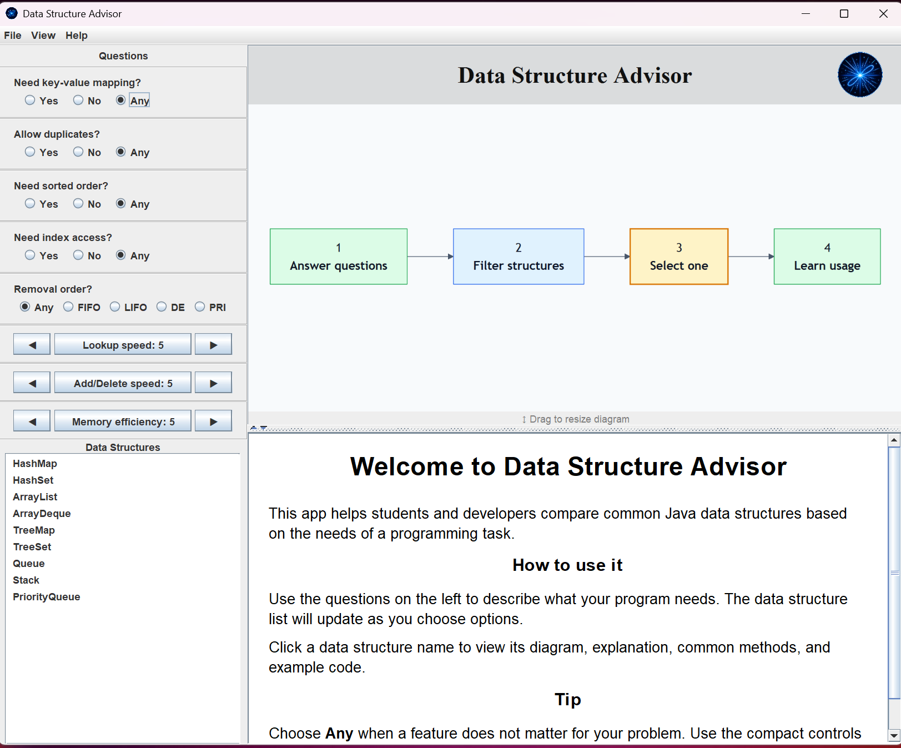
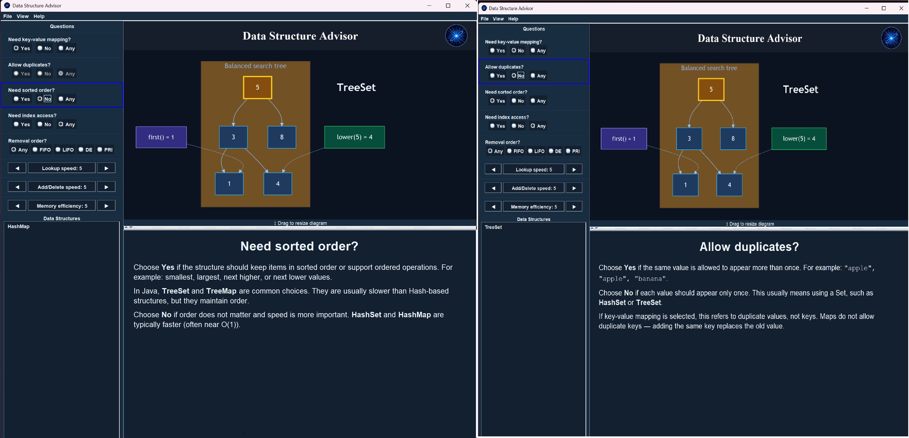

# Data Structure Advisor

A Java desktop application that helps students and developers **choose the right data structure based on real programming constraints**.
Unlike static documentation, this tool guides users through a decision process using filters, rankings, and visual diagrams.


[](LICENSE)

👉 **[Download Latest Release](https://github.com/FernandoAFOliveira/DS-Tool/releases/latest)**

---

## Preview



---

## Features

- Compare common Java data structures:
  - ArrayList, Stack, Queue, PriorityQueue
  - ArrayDeque, HashSet, TreeSet
  - HashMap, TreeMap

- Filter by:
  - Key-value mapping
  - Duplicate support
  - Sorted order
  - Index access
  - Removal behavior

- Rank results by:
  - Lookup speed
  - Add/remove speed
  - Memory efficiency

- Interactive visual diagrams for each structure
- Built-in explanations:
  - Key concepts
  - API overview
  - Example code

- Multiple UI themes:
  - Light
  - Dark
  - Soft Blue
  - Dark Blue

---

## Screenshots

### Data Structure Comparison


### Dark Theme


---

## Download

Download the latest version from GitHub Releases:

👉 https://github.com/FernandoAFOliveira/DS-Tool/releases/latest

### Available packages:
- Windows installer (`.exe`)
- Linux package (`.deb`)

---

## Quick Start (Run from Source)

```bash
git clone https://github.com/FernandoAFOliveira/DS-Tool.git
cd DS-Tool
mvn clean javafx:run
```
---

 ### Requirements
 - Java 21
 - Maven

---

 ## Why this project?

Choosing the right data structure is one of the most important decisions in programming, but it's often taught in isolation.

This tool bridges the gap by:
- Connecting theory with real use cases
- Providing visual intuition
- Helping users make decisions based on constraints

## License
This project is licensed under the MIT License.

## Contributing

Contributions are welcome.

Ways to help:
- Improve explanations and examples
- Add new data structures
- Improve diagrams and themes
- Report bugs
- Suggest better ranking logic

Please see [CONTRIBUTING.md](CONTRIBUTING.md) for setup instructions and contribution guidelines.
