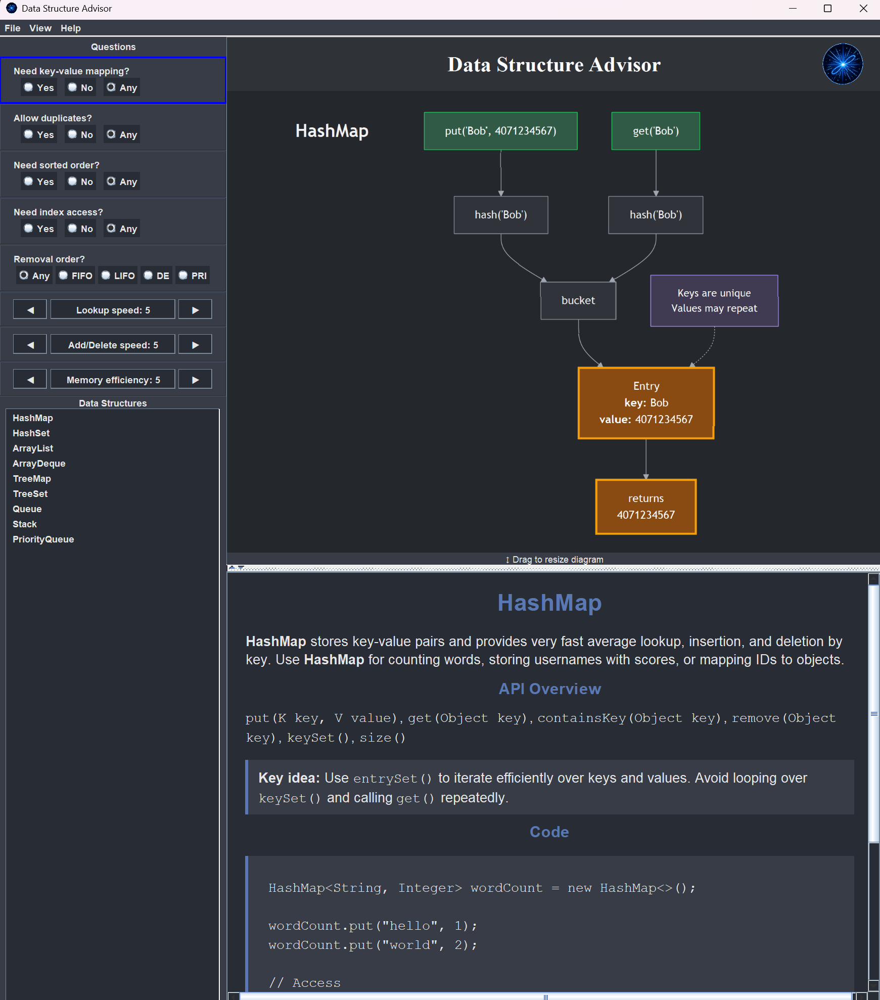
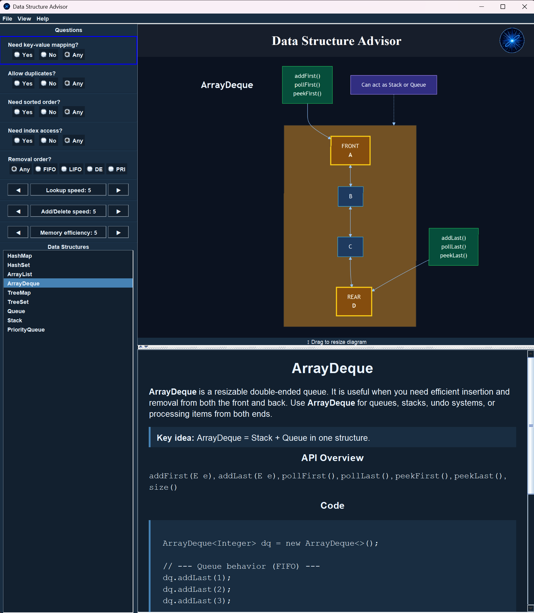

# Data Structure Advisor

Data Structure Advisor is a Java desktop application that helps students compare common Java data structures and choose an appropriate structure for a programming task.

The app provides an interactive GUI with questions, filters, ranked data structure suggestions, visual diagrams, explanations, API summaries, and example Java code.

## Screenshots

### Main Interface


### Data Structure Comparison


### Dark Theme


### Dark Blue Theme


## Download

👉 [Download Latest Release](https://github.com/FernandoAFOliveira/DS-Tool/releases)

## Features

- Compare common Java data structures:
  - ArrayList
  - Stack
  - Queue
  - PriorityQueue
  - ArrayDeque
  - HashSet
  - TreeSet
  - HashMap
  - TreeMap
- Filter by:
  - key-value mapping
  - duplicate support
  - sorted order
  - index access
  - removal order
- Rank results by:
  - lookup speed
  - add/delete speed
  - memory efficiency
- View themed diagrams for each structure
- Switch between light, soft blue, dark, and dark blue themes
- Read explanations, API overviews, and example code

## License
This project is licensed under the MIT License.

## Requirements

- Java 21
- Maven

## Quick Start

git clone https://github.com/FernandoAFOliveira/DS-Tool.git
cd DS-Tool
mvn clean javafx:run

## Running the App

From the project root:

```bash
mvn clean compile
mvn javafx:run 

No separate requirements file is needed. Maven downloads the required dependencies automatically.
If JavaFX fails to launch, ensure JavaFX is properly installed or use:
mvn clean javafx:run